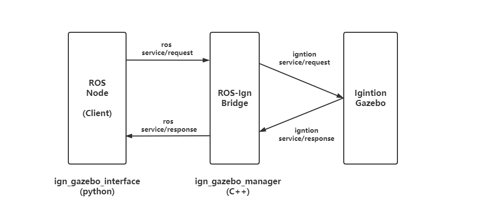

# ros_ign_gazebo_manager

`ros_ign_gazebo_manager` : control Ignition Gazebo with ROS python,

* for example, you can resume or pause  Ignition Gazebo, in addition, you can also create model, delete model and set pose of model with ROS code.
*  `ign_gazebo_interface.py`  is implemented to  control Ignition Gazebo as ROS client Node, so it's convenient to control Ignition Gazebo with python (sometimes, python is more flexible to do some tasks)

> only C++ is supported in `ign-transport` , so we can't use python to communicate with Ignition Gazebo directly. 

 `ros_ign_gazebo_manager` make ROS as  bridge to implement this function indirectly.



### Usage/example

Environment

* ROS2: foxy
* Ignition Gazebo: Dome

launch a empty world In Ignition Gazebo and `ign_gazebo_manager` node

```bash
ros2 launch ros_ign_gazebo_manager test.launch.py 
```

* currently, the  world name is hard-code with `default` .
* the ros services `ign/default/control`,  `ign/default/create` . etc will be created.

control Ignition Gazebo with python script

```bash
ros2 run ros_ign_gazebo_manager ign_demo.py 
```